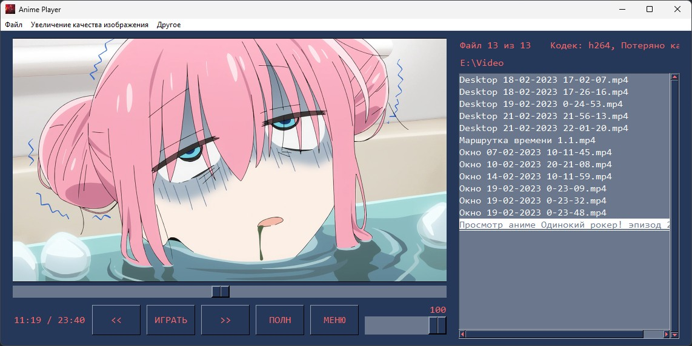

# Anime Player

Видеоплеер с функцией улучшения качества рисованного изображения путем векторизации исходного изображения с помощью высокопроизводительного алгоритма масштабирования Anime4K.

Эта программа представляет собой видеоплеер, написанный на языке программирования Python с использованием библиотеки графического пользовательского интерфейса PySimpleGUI, мультимедийного проигрывателя mpv и алгоритма масштабирования Anime4K. Anime Player предназначен для воспроизведения видео и аудио файлов и включает в себя такие функции, как открытие URL-адресов и папок, настройка параметров масштабирования изображения с помощью алгоритма Anime4K, воспроизведение/приостановка видео, просмотр справки и информации о программе.
Графический интерфейс включает два столбца: один для отображения списка файлов в папке, а другой — для отображения видео и элементов управления.

Cсылка на репозиторий алгоритма Anime4K: https://github.com/bloc97/Anime4K
