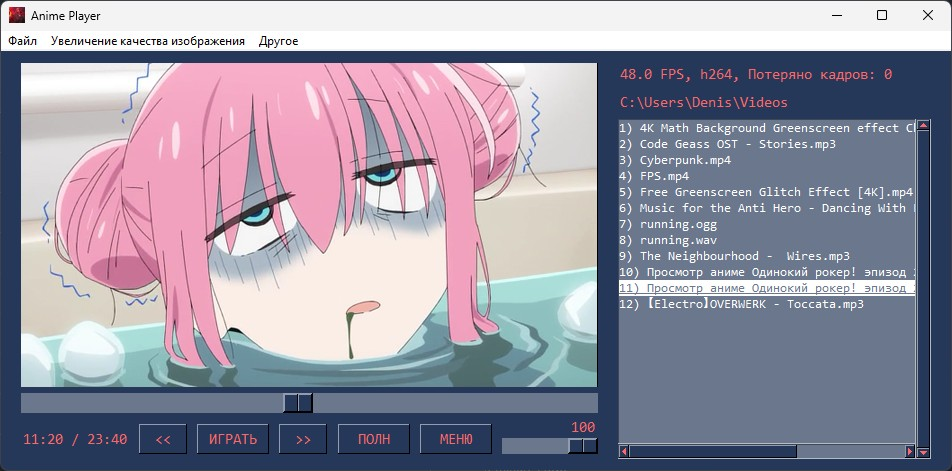

# Anime Player

Видеоплеер с функцией улучшения качества рисованного изображения путем векторизации исходного изображения с помощью высокопроизводительного алгоритма масштабирования Anime4K.

Эта программа представляет собой видеоплеер, написанный на языке программирования Python с использованием библиотеки графического пользовательского интерфейса [PySimpleGUI](https://github.com/PySimpleGUI/PySimpleGUI), мультимедийного проигрывателя [MPV](https://mpv.io/) и алгоритма масштабирования [Anime4K](https://github.com/bloc97/Anime4K). Anime Player предназначен для воспроизведения видео и аудио файлов и включает в себя такие функции, как открытие URL-адресов и папок, настройка параметров масштабирования изображения с помощью алгоритма Anime4K, воспроизведение/приостановка видео, просмотр справки и информации о программе.
Также в плеере есть поддержка интерполяции кадров с помощью SVP (для работы требуется установить на ПК [SVP](https://www.svp-team.com/) и [VapourSynth](https://github.com/vapoursynth/vapoursynth/releases)).
